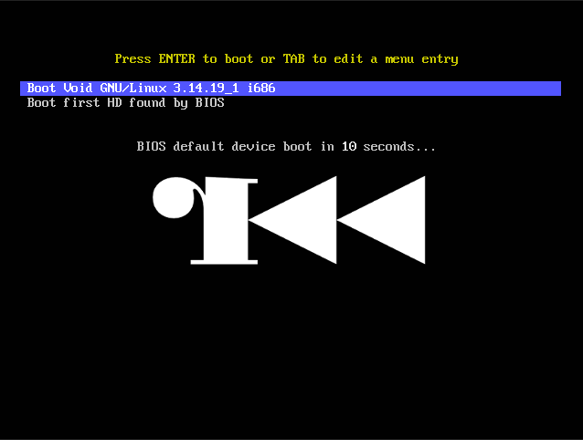
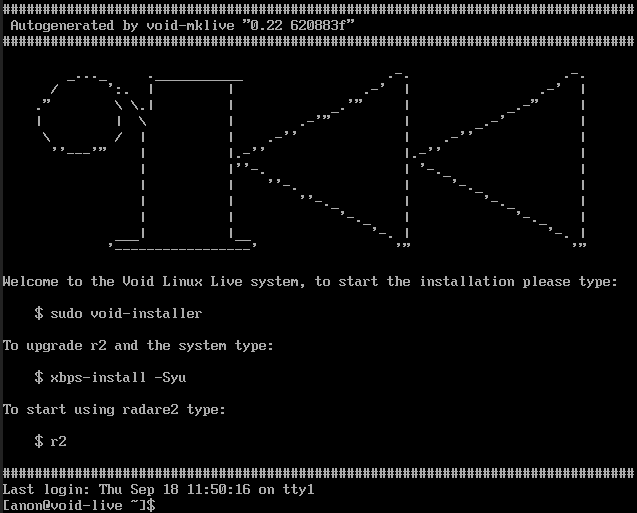

Radare2 Live
============

This repository contains all the necessary stuff to construct a minimal livecd image using the Void linux distribution that ships r2 by default.

Stuff you can do:

* Debug malware in a virtual machine
* Get free internets with `dhcpcd ens3`
* Run `sudo void-installer` to install it

To create a [voidlinux](http://voidlinux.eu) live image with r2:

	$ make

Flash in a pendrive, CD-ROM or boot it like this:

	$ qemu-system-i386 -curses -cdrom r2live.iso

	$ qemu-system-x86_64 -cdrom r2live.iso

TODO
----

* Enlarge rootfs
* shrink filesystem contents
  - create new base pkg (base-system-r2) without the firmware files
  - use busybox base-system
